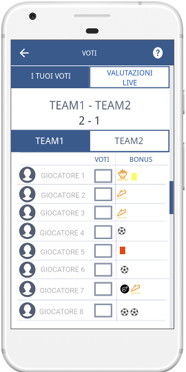
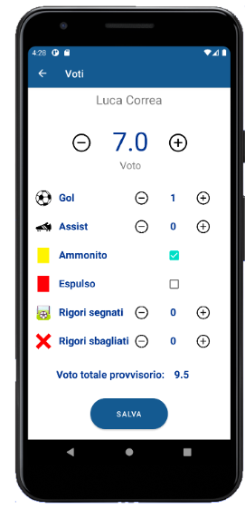

## Targeted students and pre-requisites
The Fantasy Soccer app project is used in a Bachelor Course in Computer Science. However, at least for the interface design, the case study may be relevant also in other courses focused on UX design. Given that it is a final project assignment for assessing an introductory HCI course, the pre-requisites include both a basic knowledge of the HCI design principles and, for implementing the app, proficiency in Object-Oriented and event-based Graphical User Interface programming.

## Objectives
The main objective is to practice the HCI principles discussed in the introductory course and apply a UCD approach. In particular, the students will go into the prototyping phase at different levels of fidelity (low and high). They will also perform a small user study to assess the overall usability of the proposed solution. Since it is a group project, the objective is also to develop the students' team-working skills, including the management of possible conflicting ideas in the design and implementation process.

## Pedagogical steps/monitoring, initial materials and tools
The students should focus on applying the UCD process and implementing the prototypes. Therefore, the other aspects of the applications should be only drafted. For instance, they can avoid implementing a proper account sub-system or include method stubs returning hard-coded values for avoiding using databases. Since these are techniques we often use in the prototyping phase, but they require some experience for avoiding getting stuck into less relevant details, we provide the students with:
* Templates for the delivery of all the assessed material.
* Sample projects developed by the teachers, including all the required deliverables, with explanations regarding the implementation.
* Mentoring throughout the entire course and during the implementation of the high-fidelity prototype.

The steps for completing the project are the following:
* During the first half of the course, the students know each other during class and lab lessons. We ask them to define groups of 2 to 4 students. After the process finishes, we create random groups of the same size for those people that did not express any preference.
* During the lab lessons in the second part of the course, they must complete design exercises in the lab. This includes familiarising with design and prototyping techniques (scenarios, personas, sketching etc.). Students can work together and discuss ideas and problems with teachers. This leads to an iterative design of the application interface.
* The last lab lesson includes a discussion of the main principles for designing the evaluation. The students are provided with samples evaluation design and collected data from different types of applications. They learn how to define an evaluation goal, prioritise and select the correct metrics and/or questionnaires for collecting meaningful data (e.g., SUS~\cite{ref1}). Their task is to define the goal, the material, the questionnaire, and the metrics for evaluating the Fantasy Soccer application.
* At the end of the course, they must send an intermediate deliverable that the teachers will assess. It includes the specification of the requirements, the personas and scenarios, the discussion of a low fidelity prototype for the application. They receive feedback on such deliverable, which they must consider for the final implementation of the application.
* After that, they start with the implementation of a high-fidelity prototype. They must focus on the interface-related development aspects. The application back-end should include only stubs. Students are free to request a meeting with the teachers whenever they would like to.
* When the implementation is completed, the students must conduct a small usability study, including one or two metrics and about 10 people. They must identify which changes or improvements would be possible in the next iteration.
* Finally, at the end of the development, they must present the implementation results to the teachers. The discussion includes an introductory PowerPoint presentation, a demo of the high-fidelity prototype, the presentation of the evaluation results, and a question-and-answer session.

## Expected outputs and Evaluation
The expected output is the design and implementation of a mobile application supporting the team management and the players in the peer-to-peer grading for each game. The expected outcomes are basically two: an intermediate deliverable including the low-fidelity prototype and a final deliverable including the high-fidelity prototype. The evaluation focuses on the application of basic HCI design principles and on the ability of the group to justify the design choices.

The evaluation grid for the project assigns 19 points out of the 30 available for the entire course, distributed as follows:
* 8 points for the low-fidelity prototype deliverable
    * 1 point for the identification of the requirements 
    * 3 points for the identification of the scenarios and personas
    * 4 points for the development of the low fidelity prototype
* 11 points for the high-fidelity prototype
    * 5 points of the explanation of the design choices
    * 4 points for the high-fidelity prototype interface
    * 2 points for the usability evaluation

_A Sample low-fidelity prototype for the live scoring interface (by Eligio Cabras) and the high fidelity prototype for the same interface (by the group Urlo del sIUM: Alessandro Pruner, Alessio Piriottu, Eligio Cabras and Marco Mulas)._