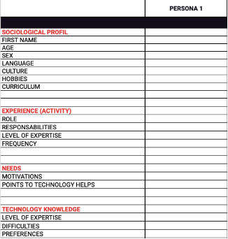
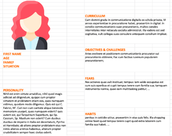
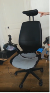
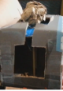
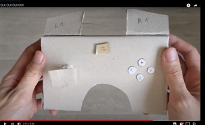
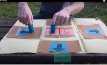

## Targeted students and prerequisites
The Kart Racing Game case study is used in a Master course in Computer Science. But this case study could be used for teaching HCI to UX designers or ergonomists. The pre-requisite in HCI for this case study includes knowledge on how to design the software of an interactive system in particular event-based principles and automata. There is no pre-requisite in Software Engineering since it is not required to develop an interactive system.

## Objectives
The main objective is to apply a User-Centered Design (UCD) approach. To guide students, several methods, concepts and tools that support the UCD steps are taught in the course related to this case study. The case study is a practical application of the fundamental HCI methods and concepts to follow the UCD principle, that are necessary to any practitioner involved in the design of useful and usable interactive systems.

## Pedagogical steps/monitoring, initial materials and tools
In order to help students to focus on UCD principles, 1) the functional core is provided, and the focus is only on the input user interface 2) the provided elements to start the UCD process are realistic representations of starting points of industrial projects.

During a 6-week period, groups of 4/5 students design and sketch/develop the game controller of <a href="https://ihm2019.afihm.org/\#challenge.html">SuperTuxKart karting races</a>. The set of commands and the output device (a screen) are fixed. As starting materials, we also provide realistic answers of three potential users to the question <q>Do you ever play video games such as kart racing?</q>. These answers are fictive ones but allow students to define persona and realistic contexts of use. The following are some sample responses:

> **A1)** Yes, but not often. I started because one of my granddaughters, Laura, came to our house during a recent holiday with her video game console. Usually when she comes, we go to the park but this time she was a little sick so we opted to stay inside most of the time. So, she spent a lot of time playing with her console. Of course, when I was a kid, I didn't have that, so I wanted to see how it works and what she is doing with it. I am curious. My granddaughter wanted to try but I didn't understand the game she was playing. They're heroes now, you see ... I don't know them. But Laura had a kart game and she said to me <q>OK grandpa, you know how to drive, so you have no excuse</q> and I couldn't say no: my granddaughter challenged me. I played and... I lost. I lost because this thing is not the same as driving. But now when Laura comes, she always takes her console to play with me. She is happy because for once she is teaching me something so she is proud.

> **A2)** Yes, very often. I've always played on consoles or on the phone. About the car races... we mostly do it with my roommates because it is quick and everyone likes it. And in fact, we use it to plan household tasks. The apartment quickly gets dirty if we don't clean the house but nobody wants to do it so we take turns but hey ... sometimes it doesn't work. So we use the kart racing game to challenge ourselves and the one who loses has a pledge. It can be something other than cleaning, but often that's it. We even defined rules. The pledge must be known beforehand, the person who is challenged has the right to refuse the race but if s/he accepts it, s/he is the one who chooses the race and the vehicles... It's more fun than bickering all the time.

> **A3)**
Yes, but not often. Me, I like it but Mom, she doesn't like that I play too long so she doesn't let me play often. I am not allowed when there is school… and I am not allowed to play in my room, I have to be in the living room. The other day, my big brother looked after me and since I didn't bother him, he let me play, but we cannot tell Mom. When I have the right, Mom tells me how long on the clock and I have to stop when it's time. I do it because otherwise I have no right to play at all.

The answers are defined to present contexts of use with characteristics (Table 1). Such starting materials are unusual for the students (in computer science).

_Table 1: Characteristics of the contexts that are used by the teacher to define the fictive answers._

| Answer   | User profile | Motivation/Goal | Playing Mode | Environment |
|----|--------------|-----------------|--------------|-------------|
| A1 | Grandfather (novice, adult,  ~65 y.o); Granddaughter (regular player, child, ~9 y.o) |  Challenge the other, to spend time together | 2 players | Living room, No dedicated space, isolated from other inhabitants |
| A2 | Young roommate (expert player, young adult,  ~20y.o) | Plan household tasks | &gt; 2 players (several) | Shared living room  |
| A3 | Son  (novice player, child,~7y.o) | Pleasure, reward | 1 player | Shared living room (with parental time control) |

Based on these initial materials, the pedagogical steps that are discussed each week with the teacher include:
* Analysis of the answers to define persona. A canvas for describing persona is provided (Figure 2). This canvas is adapted from a framework of the Marketing domain to define buyer-persona. From this analysis, student groups choose to target one or two user profiles.
* Analysis of the answers to define different contexts of use and the requirements they imply.
* Iterative design of different mock-ups or functional prototypes (for instance wire-frame prototypes using <a href="https://balsamiq.com/">Balsamiq</a>). The various solutions are discussed with a simple notation as [QOC (Questions, Options, and Criteria)](https://gamesqa.files.wordpress.com/2008/03/heuristics_noahschafferwhitepaper.pdf) for analysing the designed solutions in relation to the context requirements. Figure 3 presents examples of designed solutions.
\item Evaluation based on [heuristics that are specific for games](https://gamesqa.files.wordpress.com/2008/03/heuristics_noahschafferwhitepaper.pdf) are applied to the designed solutions (at least one of the designed solutions).
\item The last required step is to perform a simplified usability study. The pedagogical objective is to learn that the evaluation of an interactive system implies to perform a user study. They need 1) to identify a usability question to evaluate (e.g., user satisfaction, efficiency), 2) to define the data to be collected in order to answer the usability question (such as number of errors while performing a task, questionnaires e.g., [SUS](https://www.researchgate.net/profile/John-Brooke-6/publication/228593520_SUS_A_quick_and_dirty_usability_scale/links/5f24381392851cd302cbaf25/SUS-A-quick-and-dirty-usability-scale.pdf), [AttrakDiff](https://www.sciencedirect.com/science/article/pii/S1162908815000651?casa_token=Zj5gpyxtXBAAAAAA:IC9sxXkLSwPB8ZVBAKE_j9dU8IhKt3i7VKjhtDBQBECzLsXacrmN_Ddp2cKolM0IP39h61H82Q4), and 3) to define the instructions for the participants. From these specifications, they perform the test with at least three users, and they try to conclude on the usability of their designed solution.

_Figure 2: Canvas to help students define persona._

|  |  |  | |
|-----:|:--:|:--:|:--:|
 | |  |  |
| | a) | b) | c) | 

_Figure 3: Examples of designed solutions a) for a novice grandfather, b) for an expert roommate student, c) for a 7-year-old child._

## Expected output and evaluation
The expected output is the design of a game controller of SuperTuxKart kart racing game that matches the requirements extracted from at least one of the three initial answers. The most important results of the project are the justifications provided to show that the designed controllers match the initial responses, the users' profiles and the contexts for using the game. The evaluation grid is set to focus on the presentation and argumentation of the designed solution. Intermediate productions are not evaluated. Students provide a video and possibly a text document to present their game controller and explain their design choices.

The 10-point evaluation grid includes:
* 5 points for the presentation of the interactive solution
  * 3 points for the presentation of the solution in its context of use
  * 1 point for the presentation of the interaction (dynamic specification)
  * 1 point for the presentation of the elements of controls, their positions and their shapes
* 5 points for explanation of design choices
  * 4 points to explain the choices made according to the context of use
  * 1 point to explain the limitations of the currently designed solution.
